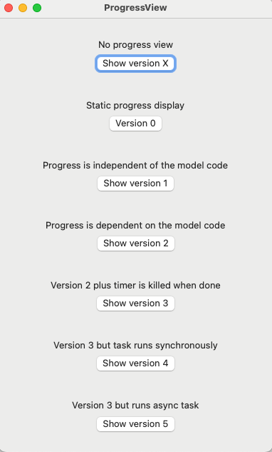
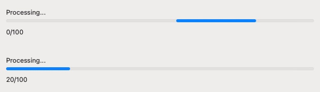
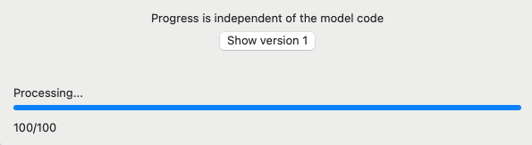

#  Determinate ProgressView

## About

The macOS app documented here looks at different aspects of displaying a determinate progress view. The goal is to understand how to have progress in the completion of a function displayed using ProgressView.



- Version X: getting start -- run a lengthy operation without displaying a progress view
- Version 0: the basics -- shows what a default determinate progress bar looks like; brings up 2 instances of a progress view with a static progress value
- Version 1: show a progress bar that shows progress, but the progress isn't meaningful
- Version 2: working example -- show a progress bar that shows progress of a function executing a lengthy operation
- Version 3: enhances version 2
- Version 4: a demonstration of how things fail 
- Version 5: an alternate of Version 3 based on async/await code

## Getting Started

### A Lengthy Operation
Executing a task, for example using a button to run the task, is straightforward. In this implementation, clicking the button launches a function `lengthyOperation`:

```
struct RunViewX: View {
    var body: some View {
        VStack {
            Button {
                lengthyOperation()
            } label: {
                Text("Run")
            }
        }
     }
}
```

As the function may take a while to complete, providing feedback to the user that all is well can be helpful. (Another important consideration is that the application is unresponsive while `lengthyOperation` is running.)

For the sake of discussion, consider the following model code. The `lengthyOperation` function has some defined steps where progess can be reported, and goes off for extended time while computing these steps. While it might seem tempting to simulate the lengthy task using a sleep-like function, doing so leads one down a rabbit hole on how to avoid timer concurrency concerns that are likely not relevant here. Using a processing loop avoids side issues and probably better mimics code in an actual implementation.

```
var lengthyProgress: Double = 0

// MARK: - Code without async/await

func lengthyOperation() {
    print ("long running function: start")
    lengthyProgress = 0
    while lengthyProgress < 100 {
        lengthyProgress += 10
        lengthyStep()
        print ("long running function: progress = \(lengthyProgress)")
    }
    print ("long running function: done")
}

func lengthyStep() {
    for i in 0..<1000000 {
        let _ = i * 2
    }
}

```

### Determinate Progress View
A progress view is one that shows progress toward completion of a task. An indeterminate view shows progress while completing a task of unknown duration.
A determine view shows a measure of progress while completing a task with a determinate end, such as downloading a file with a known size or advancing through a defined number of steps.
 
SwiftUI's `ProgressView` can be used to manage the display of the progress view. 

A basic determinate progress view with a given progress toward completion is shown in this image:



The top portion shows the display when the progress and total values are 0, where the completion bar moves back and forth from 0 to 100%. The bottom portion displays a completion bar when the total is not 0.

This is the view code for the image above: 

```
struct View0: View {
    var body: some View {
        VStack(alignment: .leading) {
            ProgressView("Processing...", value: 0, total: 0.0)
            Text("\(Int(0))/100")
        }
        .padding()

        
        VStack(alignment: .leading) {
            ProgressView("Processing...", value: 20, total: 100.0)
            Text("\(Int(20))/100")
        }
        .padding()
    }
}
```

This view code shows a button that toggles display of the progress view above:

```
struct RunView0: View {
    @State private var isRunning = false

    var body: some View {
        VStack {
            Text("Static progress display")
            Toggle(isOn: $isRunning) {
                Text("Version 0")
            }
            .toggleStyle(.button)
        }
        .padding()

        if isRunning {
            View0()
                .padding()
        }

     }
}

```

## Asynchronous Operation
Running a model task and progress view synchronously means that they run sequentially. The result is that the progress view starts with the progress at 0, then the model task runs, and when the model task is finished the progress view is updated with the latest value of `progress` (quite possibly 100%). In other words, the actual progress is not effectively displayed. To be effective, the model task can be run asynchronously so that the view and model code run concurrently.

In this code a user launches a model task, `lengthyOperation` asynchronously: 

```
struct RunViewDispatch: View {
    @State private var isRunning = false

    var body: some View {
        VStack {
            Text("Progress is independent of the model code")
            Button {
                isRunning = true
                DispatchQueue.global(qos: .background).async {
                    lengthyOperation()
                }
            } label: {
                Text("Show version 1")
            }
        }
        .padding()

        if isRunning {
            View1(show: $isRunning)
        }
    }
}
```

## Dynamic Progress: Adding a Timer
Displaying a dynamic level of progress is more invovled as some level of interaction is required so that progress made during the run task is used by the progress display. In a model-view paradigm, interaction between modeling code and view code must be done with care to avoid the **Publishing changes from background threads is not allowed** warning.

One way to deal with a dynamic level of progress is to use a timer, where timer events are used to update the view on the status of the model code. This works because the timer event can make use of the `.onReceive` method that deals with concurrency. This avoids a warning about publishing changes from background threads.

Here's view code that adds a timer that dynamically creates an event where the progress can be updated.

```
struct View1: View {
    @Binding var show: Bool
    @State private var progress: Double = 0.0
    let timer = Timer.publish(every: 0.5, on: .main, in: .common).autoconnect()

    var body: some View {
        VStack(alignment: .leading) {
            ProgressView("Processing...", value: progress, total: 100.0)
                .onReceive(timer) { _ in
                    if progress < 100.0 {
                        progress += 10 // updates progress (but independent of model code)
                    } else {
                        show = false
                    }
                }
            Text("\(Int(progress))/100")
        }
        .padding()
    }
}
```

Although the progress is dynamically updated, it isn't based on model code. So while this might look interesting, it likely isn't very useful without additional coding. We need the `progress` value to be linked to a value reported in model code. 

### App Version 1

In review, here is the sequence of events:

- display a button to launch the `lengthyOperation` function -- see RunViewDispatch
- start progress display -- see View1
- run the task -- see the model implementation of `lengthyOperation`
- stop progress display -- updates stop when progress = 100%, see View 1

Note that the reported progress is independent of the function `lengthyOperation`, so the progress reported has nothing to do with the actual progress. This is considered next. 



## Linking the View and Model
In the code above the progress view still has no knowledge of the status of `lengthyOperation`. It also seems that the timer will continue to run as long as the progress view is being executed.

Looking back at the implementation of `lengthyOperation`, there is a global variable `lengthyProgress` that reports its progress.

In this version of the progress view the view `progress` is tied to `lengthyProgress`:


```
struct View2: View {
    @Binding var show: Bool
    @State private var progress: Double = 0.0
    let timer = Timer.publish(every: 0.5, on: .main, in: .common).autoconnect()

    var body: some View {
        VStack(alignment: .leading) {
            ProgressView("Processing...", value: progress, total: 100.0)
                .onReceive(timer) { _ in
                    progress = lengthyProgress     // lengthyProgress is updated in model code
                    if progress >= 100.0 {
                        show = false
                    }
                }
            Text("\(Int(progress))/100")
        }
        .padding()
    }
}
```

## Stop the Timer
It is possible to kill the timer using

```
timer.upstream.connect().cancel()
```

Adding this to the progress view looks like 

```
struct View3: View {
    @Binding var show: Bool
    @State private var progress: Double = 0.0
    let timer = Timer.publish(every: 0.5, on: .main, in: .common).autoconnect()

    var body: some View {
        VStack(alignment: .leading) {
            ProgressView("Processing...", value: progress, total: 100.0)
                .onReceive(timer) { _ in
                    progress = lengthyProgress
                    if progress >= 100.0 {
                        show = false
                        timer.upstream.connect().cancel()
                    }
                }
            Text("\(Int(progress))/100")
        }
        .padding()
    }
}
```

When the progress becomes 100%, the timer stops running and the progress view becomes static. 

### App Version 3: A Complete Solution 

In review, here is the sequence of events:

- display a button to launch the `lengthyOperation` function -- see RunViewDispatch
- start progress display -- see View3
- run the task -- see the model implementation of `lengthyOperation`
- stop progress display -- updates stop when progress = 100%, see View 3

## Alternate Asynchronous Implementation

Wrapping the `lengthyOperation` function in 

```
DispatchQueue.global(qos: .background).async {
    lengthyOperation()
}
```

indicates that `lengthyOperation` is to be run asynchronously, which allows the execution of `lengthyOperation` and `ProgressView` to be run concurrently.

An alternate approach is to use the async/await concurrency code.

The async version of the model code looks like

```
func lengthyOperationAsync() async {
    print ("long running function: start")
    lengthyProgress = 0
    while lengthyProgress < 100 {
        lengthyProgress += 10
        await lengthyStepAsync()
        print ("long running function: progress = \(lengthyProgress)")
    }
    print ("long running function: done")
}

func lengthyStepAsync() async {
    for i in 0..<1000000 {
        let _ = i * 2
    }
}
```

Within the view code,

```
DispatchQueue.global(qos: .background).async {
    lengthyOperation()
}
```

is replaced by

```
Task { @MainActor in
    await lengthyOperationAsync()
}
```

The `Task{@MainActor}` construct is included since the function is being called within a SwiftUI function that does not support concurrency.

The new view code looks like

```
struct RunViewAsync: View {
    @State var message: String
    @State var version: String
    @State private var isRunning = false

    var body: some View {
        VStack {
            Text(message)
            Button {
                isRunning = true
                Task { @MainActor in
                    await lengthyOperationAsync()
                }
            } label: {
                Text("Show version \(version)")
            }
        }

        if isRunning {
            View3(show: $isRunning)
        }
    }
}
```
